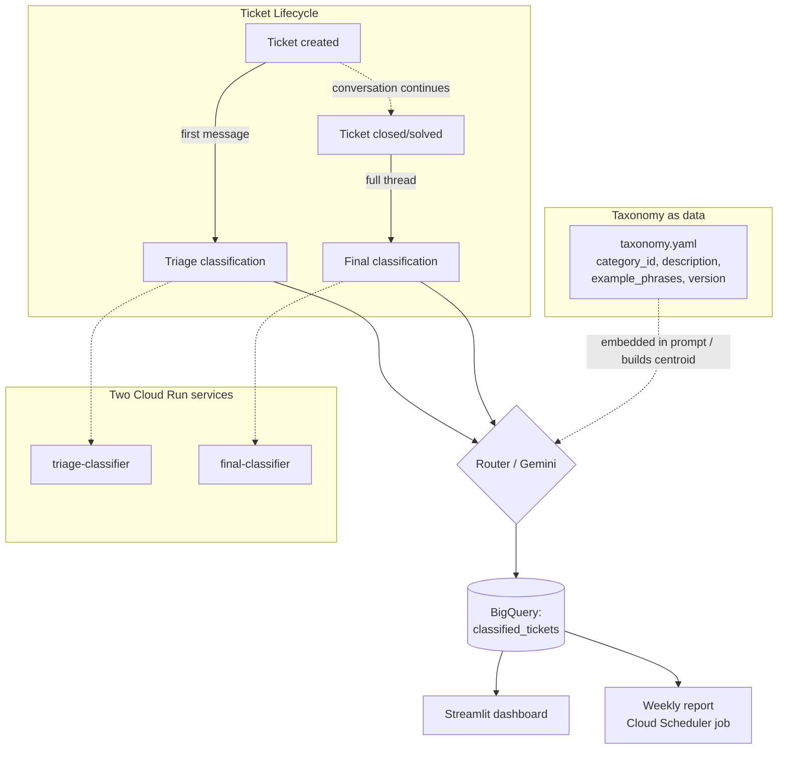

# NovaCart Support Contact Categorisation

A simulated two-stage support-ticket categorisation pipeline for NovaCart, a fictional mid-sized e-commerce marketplace — built as a portfolio project to explore a real operational question: **how do you know what's driving your support volume, in near real time, without hand-tagging every ticket?**

📖 **[See the wiki](../../wiki) for the extensive Q&A, the two-way implementation roadmap, and the full engineering log.**

---

## Executive summary

NovaCart's support team had no reliable, real-time answer to "why are people contacting us right now" — only what an agent happened to tag, days later, inconsistently. This project simulates a two-stage classification pipeline (triage at ticket creation, final classification at ticket close) against a synthetic-but-realistic dataset, compares four classification approaches head-to-head, and deploys the best one as a live Cloud Run + BigQuery pipeline. The headline result: a lightweight self-hosted "hybrid router" gets 92.7% accuracy at zero marginal cost, while zero-shot Gemini gets 98.7% for about $1.40 total spend on this entire exercise — a genuine, measured build-vs-buy tradeoff, not a guess.

---

## The problem, explained plainly

Picture a NovaCart ops manager on a Monday morning. Contact volume is up 15% week over week. Is that a shipping carrier having a bad week? A bug in the returns flow? A confusing new discount code? Without knowing the *shape* of what's coming in — not just the count — there's no way to route the fix to the right team, or even know there's a single common cause at all.

The obvious fix — have agents tag every ticket with a reason — has three real problems in practice:
1. **It's after the fact.** By the time a ticket is closed and tagged, the spike has already been driving contacts for days.
2. **It's inconsistent.** Twenty agents tag the same kind of issue twenty different ways.
3. **It doesn't scale to new problems.** The day a new bug appears, there's no tag for it yet — and by the time someone adds one, the early signal is gone.

This project treats that as a categorisation problem with a taxonomy as the single source of truth for "what counts as a category" — one that can be edited without touching code — and asks a second, sharper question: **when the first message a customer sends doesn't match what the ticket turns out to actually be about (a very common real-world pattern — a subject line that says "order late" but the thread reveals a refund dispute), how do you catch that, and does it matter which classifier you use?**

---

## How it works

### In plain language

Every support ticket gets classified **twice**:
- **At creation** ("triage") — using only the first message, because that's all that exists yet. Fast, slightly noisier, feeds a "what's coming in right now" view.
- **At close** ("final") — using the full conversation thread. Slower, authoritative, and this is the number that goes into trend reports.

The gap between those two classifications — not just each one's accuracy on its own — is tracked explicitly, because a ticket whose story changes mid-conversation is itself a useful signal, not noise to discard.

The list of categories (26 of them, grouped into things like *Order & shipping*, *Returns & refunds*, *Payments & billing*) lives in a config file, not in code. Adding a category — say, a new "express shipping" request type that didn't exist last month — should never require retraining a model or shipping a code change; it should be a one-line edit.

Four different approaches to the actual classification were built and compared:

| Approach | What it is | The idea |
|---|---|---|
| TF-IDF + Logistic Regression | The standard "bag of words" ML baseline | Fast, free, accurate on categories it's seen before |
| Embeddings + nearest centroid | No training at all — compares ticket meaning to each category's description | Instantly recognises a brand-new category, at the cost of some accuracy |
| Embeddings + Logistic Regression | A trained model on top of semantic embeddings | A middle ground between the two above |
| **Hybrid router** (recommended) | TF-IDF for categories it knows, centroid as a fallback for anything it's never seen | Gets the trained model's accuracy *and* the centroid's ability to handle new categories |
| Gemini 2.5 Flash (Vertex AI) | The taxonomy is put directly into the prompt, zero-shot | No training step at all, ever — and it's the most accurate of everything tested |

### Technically



- **Taxonomy** (`src/taxonomy.yaml`) — each category has an id, name, group, description, example phrases, a status (active/deprecated), and a `taxonomy_version`. Every classified ticket records which taxonomy version was active when it was classified, so a taxonomy edit never silently reclassifies old reports.
- **Synthetic dataset** (`src/data_generation.py`) — 1,200 templated tickets with deliberate messiness: typos, variable length, and two specific stress-tests: *drift* (the conversation reveals a different issue than the subject implied) and *ambiguous* (text genuinely blending two categories). These exist because a real taxonomy is [rarely perfectly *mutually exclusive*](../../wiki/Design-Decisions#mece) — see the wiki for that discussion in full.
- **Four classifiers** (`src/classifiers.py`, `src/classifier_router.py`, `src/gemini_classifier.py`) — share a common `fit`/`predict` interface so they drop into the same evaluation harness.
- **Cloud pipeline** (`infra/`) — two Cloud Run services (one per pipeline stage), each running the router and, when enabled, Gemini, writing both predictions per ticket to BigQuery. Deploy-once, demo, tear down — not meant to run continuously.
- **Dashboard** (`dashboard/app.py`) — a local-first Streamlit app answering three questions at a glance: what's driving contacts, is anything spiking, is the pipeline healthy (i.e. is the triage/final disagreement rate normal).

---

## What's in this repo

| Path | What's there |
|---|---|
| `src/taxonomy.yaml`, `src/taxonomy.py` | The 26-category taxonomy and its loader |
| `src/data_generation.py` | Synthetic ticket + conversation generator |
| `src/classifiers.py`, `src/classifier_router.py` | TF-IDF, embedding-centroid, embedding-classifier, and the hybrid router |
| `src/gemini_classifier.py` | Zero-shot Gemini classifier, gated behind `USE_LLM_CLASSIFIER` |
| `src/classification_pipeline.py`, `src/predict_service.py` | Batch export logic and the single-ticket service used by Cloud Run |
| `notebooks/01_generate_dataset.ipynb` | Builds the synthetic dataset |
| `notebooks/02_classifier_comparison.ipynb` | Trains/evaluates the first four approaches, including the new-category test |
| `notebooks/03_build_classified_export.ipynb` | Produces the CSV the dashboard reads |
| `notebooks/04_gemini_evaluation.ipynb` | Scores Gemini on the identical held-out data |
| `dashboard/app.py`, `dashboard/theme.py` | The Streamlit dashboard and its shared colour/type system |
| `infra/` | Terraform, the Cloud Run service code, `simulate_tickets.py`, `deploy.sh`/`destroy.sh` |
| `outputs/` | Generated datasets, classifier comparison results, the classified export |
| `docs/cost_breakdown.md` | Real GCP costs from the actual deploy run, not estimates |
| `docs/engineering_log.md` | Every notable decision and bug, chronological |

---

## How to run it

### Just want to see it work — no GCP needed

```bash
git clone <this-repo>
cd support-contact-categorization
python3 -m venv .venv && source .venv/bin/activate
pip install -r requirements.txt

# regenerate the dataset (optional — outputs/ already has one committed)
jupyter nbconvert --to notebook --execute --inplace notebooks/01_generate_dataset.ipynb

# run the classifier comparison (optional, ~2 min, no cost)
jupyter nbconvert --to notebook --execute --inplace notebooks/02_classifier_comparison.ipynb

# launch the dashboard
streamlit run dashboard/app.py
```

That's the entire local path. Everything above runs with no GCP project, no API keys, no network calls other than downloading the sentence-transformers model once.

### Optional: the cloud path (Gemini + live Cloud Run pipeline)

This costs real (small) money and needs a GCP project. See **[the wiki's implementation roadmap](../../wiki/Roadmap)** for the full walkthrough — in short:

```bash
cp .env.example .env  # fill in GCP_PROJECT_ID, GCP_REGION, BQ_DATASET
gcloud auth application-default login

cd infra
cp terraform.tfvars.example terraform.tfvars  # fill in real values
./deploy.sh              # builds + pushes the image, applies Terraform
python simulate_tickets.py --dry-run --limit 5   # sanity check locally first
python simulate_tickets.py --triage-url <url> --final-url <url>  # the real thing
./destroy.sh              # tear down when done — this isn't meant to run 24/7
```

Actual cost for the full deploy → demo → teardown cycle in this project: **≈$1.41** (see `docs/cost_breakdown.md`).

---

## Results

| Approach | Final accuracy | Final macro F1 | Triage accuracy | New-category accuracy |
|---|---|---|---|---|
| TF-IDF + Logistic Regression | 92.7% | 91.9% | 98.7% | **0%** |
| Embeddings + Logistic Regression | 87.7% | 85.3% | 98.7% | **0%** |
| Embeddings + nearest centroid | 82.3% | 74.5% | 94.0% | **100%** |
| **Hybrid router** (recommended default) | 92.7% | 91.9% | 98.7% | **100%** |
| Gemini 2.5 Flash (zero-shot) | **98.7%** | **98.3%** | **99.0%** | **100%** |

**The new-category test is the finding that matters most, not the accuracy column.** A trained classifier's prediction is always an argmax over the categories it saw during training — it structurally *cannot* output a category it's never seen, no matter how confident or uncertain it is. When a brand-new category ("Express shipping request") was introduced partway through the dataset with zero prior examples, both trained approaches scored exactly 0% on it — not "low," zero, because they always guessed the nearest known category instead. The centroid, the router, and Gemini all hit 100%, because none of them need training examples to recognise a category — they only need the taxonomy entry to exist.

**The headline accuracy numbers hide real variation.** Gemini's 98.3% on the full held-out set drops to 92.5% on tickets where the conversation drifts from what the subject implied, and 80.0% on deliberately ambiguous tickets — exactly the cases the dataset was built to stress-test. On inspection, several of the "wrong" predictions on those hard cases look like label noise in the synthetic drift generator rather than genuine model errors — worth knowing before trusting any single accuracy number at face value. Full detail in `outputs/gemini_holdout_detailed_predictions.csv`.

**What the confusion matrix reveals:** the categories that get confused most are the ones that are semantically close by design — refund status vs. duplicate charge, defective product vs. wrong item received. These aren't classifier weaknesses so much as evidence that the taxonomy itself has categories that legitimately overlap for some real tickets (see the MECE discussion below).

---

## Reflections

### Cost-aware model selection

None of the free approaches are "worse" in an absolute sense — they're cheaper at a specific, measurable accuracy cost. The hybrid router costs nothing per classification and runs anywhere; Gemini costs about $0.15 per million input tokens and needs a live API dependency, but buys back roughly 6 accuracy points and handles new categories through a prompt edit instead of a taxonomy-file edit. For a team without ML engineering capacity, that gap alone can be worth paying for. For a team that already has to maintain infrastructure anyway, the router is close enough to free that the API cost is hard to justify — *until* the taxonomy starts changing often enough that Gemini's zero-retrain-and-zero-maintenance story becomes the deciding factor, not the accuracy gap.

### Designing a taxonomy for change

<a id="mece"></a>
The taxonomy in this project is deliberately data (`taxonomy.yaml`), not hardcoded categories, because the alternative — categories baked into classifier code — makes every taxonomy change a deployment. The design is loosely built around the **MECE principle** (Mutually Exclusive, Collectively Exhaustive), a common categorisation framework: the *Collectively Exhaustive* half is satisfied structurally by the `GEN-OTHER` catch-all, guaranteeing every ticket has a home. The *Mutually Exclusive* half is treated as an aspiration, not a guarantee — the dataset deliberately includes ambiguous and drift cases specifically because real support tickets routinely violate strict mutual exclusivity (a ticket can genuinely be both "wrong item" and "refund request" at once). That's exactly why the taxonomy schema carries `deprecated_at`, `replaced_by`, and `taxonomy_version` fields: they're the maintenance mechanism for the moment ops decides two categories overlap enough to merge, or one category has drifted enough to need splitting. A taxonomy that assumed perfect MECE would have no way to evolve; this one is built to.

### Local model vs. managed LLM API — the big picture

This is a build-and-own vs. pay-and-delegate decision, not just an accuracy comparison. A self-hosted classifier like the hybrid router runs anywhere, costs nothing per call, and has no vendor dependency — but someone has to build it, retrain it, and keep the training pipeline alive. A managed LLM API removes that engineering burden entirely and, in this case, is also more accurate and just as flexible on new categories — but it costs money per call and introduces a network/vendor dependency that a self-hosted model doesn't have. Neither is universally "right"; the right choice depends on whether the team's scarce resource is engineering time or budget.

---

## About this project

Portfolio project — a fictional company, a synthetic dataset, and real (small) GCP spend to validate the cloud path actually works end to end rather than just described. See `docs/engineering_log.md` for the full history of decisions and bugs found along the way, and the [wiki](../../wiki) for extended documentation.
